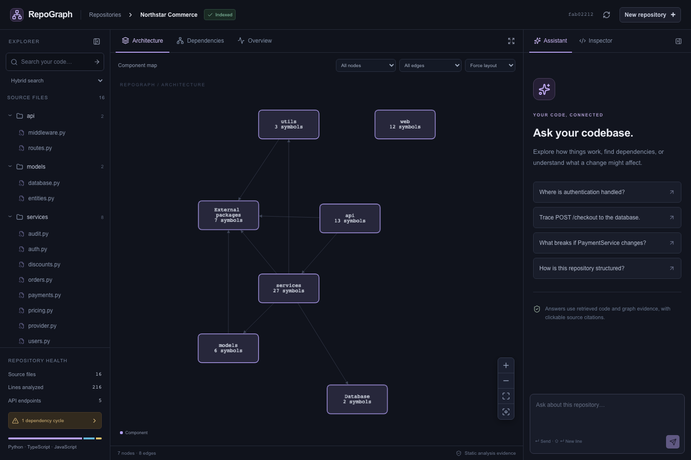
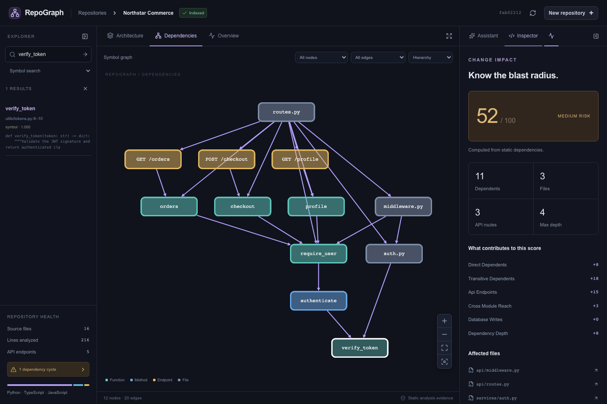
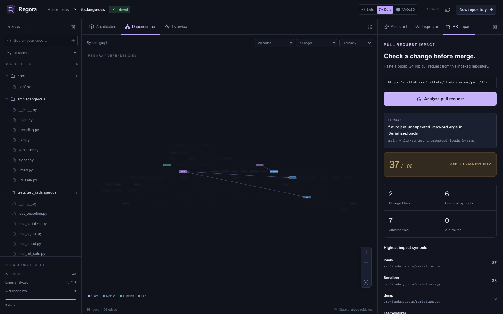
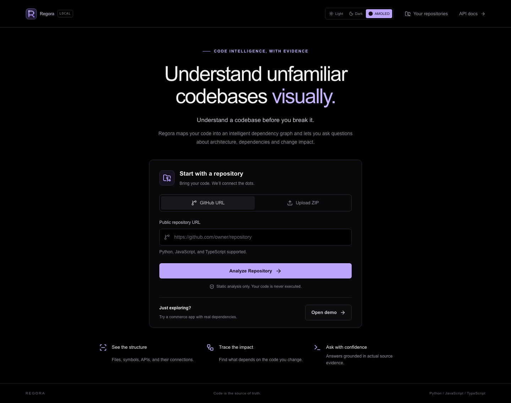
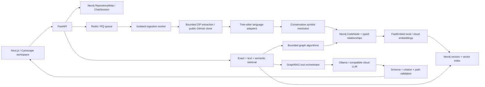

# Regora

<p align="center">
  
</p>

**Understand a codebase before you break it.**

[](https://github.com/Nithin-Akin/Regora/actions/workflows/ci.yml)
[](LICENSE)

Regora statically analyzes Python, JavaScript, and TypeScript repositories, stores an evidence-bearing dependency graph in Neo4j, and makes it explorable through a Next.js workspace. Semantic code search, graph traversal, a tool-using assistant, and algorithmic change-impact analysis share the same extracted facts.

No repository code is executed. LLMs explain retrieved evidence; they cannot write to the graph or execute arbitrary database queries.

## Run locally

Requirements: Docker Engine with Compose, internet access for the initial image/model downloads, and approximately 8 GB of memory available to Docker. The bundled language model runs on CPU; native Ollama or a cloud provider is faster. Allow disk space for Docker images, the 1.4 GB Qwen model, and the embedding model.

```bash
git clone https://github.com/Nithin-Akin/Regora.git
cd Regora
cp .env.example .env
docker compose up --build
```

Open **http://localhost:3000**. Choose **Open demo**, upload a ZIP, or enter a public GitHub repository URL. Indexing runs in a separate Redis/RQ worker. The first repository also downloads the local embedding model. The `ollama-init` service automatically pulls the configured default language model.

- Application: http://localhost:3000
- API and interactive API reference: http://localhost:8000/docs
- Service health: http://localhost:8000/api/health
- Neo4j Browser: http://localhost:7474 (credentials from `.env`)

There is **no paid API key requirement** with the default configuration. If an LLM request fails or returns invalid evidence references, the UI explicitly labels a deterministic evidence response instead. Semantic search still uses genuine embeddings; it does not substitute keyword scores and call them semantic similarity.

Useful commands:

```bash
docker compose up -d --build
docker compose logs -f backend worker
docker compose ps
docker compose down
```

`docker compose down` preserves indexed repositories and downloaded models. Avoid `down -v` unless you intend to discard that data. All published ports bind to loopback. This is a single-user local application, not an authenticated multi-tenant deployment.

## Screenshots

Actual screenshots from the running demo, captured by the browser tests.









## The workspace

- **Explorer:** indexed files, repository metrics, symbol/text/semantic/hybrid search.
- **Themes:** persistent Light, Dark, and true-black AMOLED appearances across the full application.
- **Architecture:** a compact map of real modules and external dependencies. Click a component to drill into its symbols. Components are grouped by source path, not invented by an LLM.
- **Dependencies:** Cytoscape graph with pan, zoom, dragging, layout selection, fit/focus, type and relationship filters, and bounded neighborhood expansion/collapse.
- **Inspector:** signatures, source ranges, docstrings, incoming/outgoing evidence, callers, callees, source viewing, and impact analysis.
- **Assistant:** intent-aware retrieval, application-controlled tools, persistent conversation context, clickable citations, and graph evidence highlighting.
- **Overview:** actual counts, language distribution, connection hubs, cycles, potentially unused symbols, and an automatically generated architecture explanation.
- **Paths:** choose a source node with **Set path start**, select a destination, then **Find connection**. **Trace downstream** explores dependency paths from a single node.
- **Impact:** select a function, method, class, file, or endpoint and click **Analyze Impact**. Read the score breakdown and highlight important paths.
- **Pull request impact:** paste a public GitHub pull request URL from an indexed repository to map changed lines to symbols, inspect their static blast radius, and copy or download a Markdown report for reviews.
- **Streaming assistant:** see retrieval and reasoning stages immediately, then read the grounded response as it streams after evidence validation.

Source citations open an integrated read-only, syntax-highlighted viewer at the indexed line range. Source is loaded lazily from the database, not from a client-supplied filesystem path.

## Architecture



Metadata and chat use separate Neo4j labels from graph intelligence. A separate relational database is unnecessary for this release. Redis stores job queue state; Neo4j stores persistent job stages and logs. The worker and API share an isolated repository volume.

```
backend/app/
  api/          HTTP endpoints and repository-scoped input validation
  models/       Pydantic graph, answer, and request schemas
  security/     ZIP validation, cloning, source scanning
  parsers/      Tree-sitter adapters and cross-file resolution
  graph/        Neo4j persistence and deterministic graph algorithms
  embeddings/   Local/cloud provider interface and symbol embeddings
  retrieval/    Hybrid code retrieval and deterministic scoring
  agents/       Tool registry, intent selection, GraphRAG orchestration
  llm/          Provider abstraction and untrusted-source system prompt
  workers/      Redis/RQ ingestion stages and failure callbacks
  services/     Connections and versioned bounded snapshot cache
frontend/       Next.js / TypeScript / Tailwind / Cytoscape
backend/tests/  Parser, graph, security, retrieval, agent, API tests
frontend/tests/ Small deterministic frontend tests
frontend/e2e/   Browser checks against the running application
scripts/        Live evaluation and ingestion smoke checks
demo/shop/      Northstar Commerce source-analysis fixture
```

## Parsing and graph schema

Tree-sitter supplies the syntax trees for all three languages. Python's standard AST additionally extracts exact import aliases. Source line positions are calculated from byte offsets to avoid the current Tree-sitter 0.26.0 [Point reference-count issue](https://github.com/tree-sitter/py-tree-sitter/issues/500). Language adapters share an interface returning symbols, imports, bindings, endpoint declarations, and unresolved references.

`CodeNode` records have a `type` property: Repository, Directory, File, Class, Interface, Function, Method, Endpoint, DatabaseEntity, ExternalPackage, Module, or UnresolvedSymbol. Stable IDs are hashes of repository identity, source path, qualified symbol name, and kind. Symbol IDs survive source-body edits; source content hashes and a repository fingerprint detect changed content. Moving or renaming a symbol changes its ID.

Nodes include source paths, language, line ranges, qualified names, signatures, parameters, return annotations where present, source, documentation, hashes, and optional embedding vectors. Endpoint identities also include their declaration location.

Relationships include:

| Relationship | Meaning |
|---|---|
| `CONTAINS`, `DEFINES` | Repository/directory/file/symbol ownership |
| `IMPORTS`, `REFERENCES` | Internal module imports and imported symbol references |
| `CALLS` | Call expressions resolved through lexical/import/instance bindings |
| `EXTENDS`, `IMPLEMENTS` | Declared inheritance and interface implementation |
| `HANDLES`, `DEPENDS_ON` | Route handler and recognizable FastAPI dependency injection |
| `USES_PACKAGE` | A module or callable uses an explicitly imported external package |
| `READS_FROM`, `WRITES_TO` | Recognizable ORM operations involving declared model entities |
| `BELONGS_TO` | Model declaration associated with its database entity |

Every extracted edge records a source file, source line, analysis method, confidence, and resolution status. The schema also permits `ROUTES_TO` for future additional adapters. The architecture view returns aggregated `DEPENDS_ON` edges with original edge evidence.

- **Resolved:** a target supported by the static binding rules.
- **Probable:** framework/ORM inference supported by an explicit syntax pattern.
- **Unresolved:** a target the analyzer cannot establish. It remains an explicit unresolved node rather than being matched to an arbitrary same-named symbol.

Dependency paths and impact exclude unresolved edges. ORM-derived probable edges remain distinguishable. Structural ownership edges do not count as runtime calls.

Recognized framework patterns include FastAPI and Flask decorators, simple Django `path`/`re_path` declarations, Express route registrations and callbacks, Next.js App Router `route.ts` handlers, and straightforward NestJS controller/method decorators. Python ORM model bases and common explicit operations such as `session.add(Order(...))` and `session.get(User, id)` create evidence-bearing database interactions.

## Ingestion and reindexing

1. HTTP accepts an archive or validated public GitHub URL and returns a repository/job ID with **202 Accepted**.
2. Redis/RQ schedules work outside the request lifecycle.
3. The worker clones or extracts, scans supported sources, detects languages, parses symbols, and resolves dependencies.
4. Neo4j graph replacement happens transactionally. A vector index and uniqueness constraints are initialized automatically.
5. Symbol-level embeddings are generated in batches and stored on Neo4j nodes.
6. Architecture metrics and a cited factual overview are calculated. Status becomes `READY`. A separate architecture worker then generates the AI explanation, so slow CPU inference never delays access to the indexed graph. Reopen Overview to retrieve the latest explanation.

Persistent stages are `QUEUED`, `CLONING`, `SCANNING`, `PARSING`, `BUILDING_GRAPH`, `EMBEDDING`, `ANALYZING`, `READY`, and `FAILED`. Logs include repository/job IDs, elapsed seconds, and meaningful messages. Failures and worker timeouts persist an actionable status.

The reindex action re-clones GitHub repositories, or re-analyzes the retained ZIP/demo source. It reparses the full repository, reuses unchanged symbol vectors when provider/model and dimensions match, then replaces the graph. More sophisticated incremental parsing is intentionally not required. A changed fingerprint/updated timestamp invalidates the bounded process snapshot cache. Graph paths, impact, architecture, and overview calculations are cached on versioned intelligence snapshots. AI answers are not globally cached; conversational state is persisted per repository session.

## AI and GraphRAG

The system uses genuine dense embeddings, vector retrieval, exact/lexical retrieval, graph expansion, tool calling, constrained context, and grounded generation.

1. Classify the question as discovery, explanation, dependency, impact, path, or architecture.
2. Retrieve semantic candidates and exact symbol matches; explicit names and selected symbols take priority.
3. Resolve follow-up pronouns against the session's previously discussed symbol.
4. Expand a small relevant neighborhood or retrieve paths/impact according to intent.
5. Assemble bounded source and relationship evidence, treating every repository string as untrusted data.
6. Allow the LLM to select from a fixed tool registry, with a bounded number of tool rounds.
7. Validate structured output, citation IDs, cited edge IDs, and every returned path against retrieved graph evidence.
8. Return the explanation, source citations, tool history, and graph highlights.

Tools include semantic and literal search, symbol lookup, source reading, callers/callees, neighborhoods, dependencies/dependents, shortest paths, endpoint tracing, impact, and repository overview. All ID arguments are checked against the selected repository. There is no shell, source execution, unrestricted Cypher, or graph mutation tool.

The local embedding model is `sentence-transformers/all-MiniLM-L6-v2`, run through FastEmbed/ONNX. Functions, methods, classes, interfaces, and endpoints are embedded separately; file embeddings use short symbol summaries rather than whole large files. Neo4j initializes a cosine vector index. Current search uses repository-filtered **exact vector similarity inside Neo4j** to avoid global ANN results starving smaller repositories; the index is available for a future per-repository approximate-search optimization.

Hybrid ranking combines exact name matches, token/text overlap, and semantic similarity, with a file-summary penalty favoring useful symbols. Intent chooses relevant graph direction and traversal. This is a deterministic reranking stage; no paid reranker is necessary.

The default Ollama model runs with thinking disabled and a bounded output size. Local performance depends on CPU resources. Invalid or unavailable LLM outputs yield a clearly marked static-evidence response with real citations. Failed embeddings make ingestion fail visibly and can be retried; semantic search never fabricates vectors or scores.

**Grounding is not a formal proof of prose correctness.** IDs and paths are checked programmatically, and structural claims must cite retrieved edge evidence, but a model can still misinterpret valid source. Source citations, explicit uncertainty, and the deterministic graph remain the authority.

## Change-impact score

Traverse dependencies in reverse, up to eight hops. For a file or class, include its defined members as initial seeds. Report direct/transitive dependents, affected files/modules/endpoints, database interactions, and important reverse paths. Cycles terminate because traversal tracks visited nodes.

| Feature | Contribution |
|---|---:|
| Direct dependents | `min(20, 4 × count)` |
| Additional transitive dependents | `min(25, 2 × count)` |
| Affected API endpoints | `min(20, 5 × count)` |
| Cross-module reach | `min(15, 3 × max(0, modules − 1))` |
| Database entities written by affected components | `min(10, 5 × count)` |
| Maximum dependency depth | `min(10, 2 × depth)` |

The sum is 0–100. Low is below 30; medium is 30–64; high is 65–100. The score represents potential structural reach, not a probability of failure, production traffic, or business severity. File import dependencies are included, so the impact may be conservative.

Architecture hubs use degree centrality. Cycles use strongly connected components and show one representative cycle per component rather than enumerating exponentially many cycles. “Potentially unused” means no incoming recognized repository references, not certainly dead code.

## Configuration

Copy `.env.example` and edit values before starting Compose. Compose fixes its internal Neo4j/Redis/data paths so container names resolve correctly.

| Variable | Default / purpose |
|---|---|
| `NEO4J_URI` | `bolt://neo4j:7687` in Compose |
| `NEO4J_USERNAME`, `NEO4J_PASSWORD` | Local Neo4j credentials; change before sharing access |
| `REDIS_URL` | `redis://redis:6379/0` in Compose |
| `LLM_PROVIDER` | `ollama` or `cloud` / `openai-compatible` |
| `LLM_MODEL` | `qwen3:1.7b` |
| `LLM_BASE_URL` | `http://ollama:11434/v1` |
| `LLM_API_KEY` | Empty for local Ollama |
| `GITHUB_TOKEN` | Optional token for a higher public pull request API rate limit |
| `EMBEDDING_PROVIDER` | `local` or `cloud` |
| `EMBEDDING_MODEL` | `sentence-transformers/all-MiniLM-L6-v2` |
| `EMBEDDING_DIMENSIONS` | `384`; must match the selected model/index |
| `EMBEDDING_BASE_URL`, `EMBEDDING_API_KEY` | Compatible cloud embedding endpoint/credentials |
| `DATA_DIR`, `DEMO_DIR` | Shared repository/model volume and included source fixture |
| `MAX_ARCHIVE_MB`, `MAX_EXTRACTED_MB` | 50 MB upload; 250 MB expanded repository |
| `MAX_FILES`, `MAX_FILE_BYTES` | 10,000 archive entries; 1,000,000 bytes per archive member/analyzed file |
| `JOB_TIMEOUT` | 1,800 seconds |
| `CONTEXT_CHARS` | Bounded retrieved evidence budget, default 6,000 serialized characters (increase for larger models) |

For cloud AI, set the provider, model, base URL, and key independently for LLM and embeddings. The client implements the common chat-completions/tool and embeddings protocols; providers must support them. A cloud embedding model must support the configured dimensions. Use `.env` values, never source-code secrets. Choosing a cloud provider sends selected source snippets to that provider.

For faster local inference with native Ollama on macOS:

```bash
ollama pull qwen3:1.7b
# In .env:
# LLM_BASE_URL=http://host.docker.internal:11434/v1
```

If changing embedding dimensions in an existing database, drop `code_embeddings` through Neo4j Browser, restart backend/worker to recreate it, and reindex repositories. Do not mix embedding models for query and document vectors.

Ollama protocol controls follow the [official compatibility documentation](https://docs.ollama.com/api/openai-compatibility) and [context-length configuration](https://docs.ollama.com/context-length).

## Development without containerizing application code

Keep infrastructure in Docker; use Python 3.12 and Node 22+ locally:

```bash
docker compose up -d neo4j redis ollama ollama-init
uv sync --directory backend --python 3.12
npm --prefix frontend ci

# Separate terminals, from the repository root:
uv run --directory backend uvicorn app.main:app --reload --host 127.0.0.1 --port 8000
uv run --directory backend python -m app.workers.run
npm --prefix frontend run dev
```

The backend's development defaults use localhost services, `backend/data`, and `../demo/shop`. The root `.env` is intended for Compose and is not implicitly loaded from the backend working directory. On macOS, run the worker in Docker if your Python/native libraries have fork restrictions. Stop the corresponding Compose API/frontend/worker before starting local equivalents on the same ports.

Dependency versions were resolved from current stable registry releases. `backend/uv.lock` and `frontend/package-lock.json` pin the tested dependency graph. Docker builds use frozen installs.

## Tests and evaluation

See the actual [verification report](docs/VERIFICATION.md) and [demo evaluation results](docs/evaluation-results.json).

Deterministic tests require no running database and no paid AI calls:

```bash
uv sync --directory backend --python 3.12
uv run --directory backend pytest -q
npm --prefix frontend ci
npm --prefix frontend test
npm --prefix frontend run build
```

Coverage includes functions/methods, cross-file imports and aliases, inheritance, endpoint patterns, lexical shadowing, reassigned instances, unresolved targets, ORM evidence, cycles, impact, safe source access, ZIP traversal/symlinks/limits, URL validation, provider failure, rejected fabricated citations, and an actual tool-call round with a deterministic test provider.

Run live evaluation against the complete stack:

```bash
backend/.venv/bin/python scripts/evaluate.py --output docs/evaluation-results.json
backend/.venv/bin/python scripts/smoke.py
```

Evaluation creates the demo through HTTP, waits for the worker, then measures semantic retrieval hit rate@5, known dependency recall, endpoint path accuracy, citation correctness, graph-path support, and answer evidence coverage. It separately reports how many answers came from the LLM rather than the deterministic fallback. Use `--repository ID` to reuse an indexed demo or `--skip-answers` for a quicker retrieval/graph run.

The ground truth is small and curated. “Answer evidence coverage” checks visible source and graph references; it is not an automated semantic truth score. Dependency recall measures known relationships, not global extraction precision. Acceptance requires all known dependencies and paths, and at least 60% semantic hit rate@5.

Browser checks use the running application and a ready demo:

```bash
cd frontend
npx playwright install chromium
npm run test:e2e
```

## License

Regora is available under the [MIT License](LICENSE).

These check the landing import controls, responsive width, graph canvas, actual symbol search, source ranges, and impact panel. They save screenshots to `docs/screenshots`. The API smoke script uploads an actual ZIP and shallow-clones the public `pallets/itsdangerous` repository; no database manipulation or mock graph is used.

## Demo questions

- Where is authentication handled?
- What could break if I modify `verify_token`?
- Trace `POST /checkout` to the database.
- Trace checkout to `StripeClient`.
- What breaks if `PaymentService` changes?
- Which API endpoints depend on `UserService`?
- Where is the database updated when an order is created?

Northstar Commerce includes authentication, users, orders, payments, a Stripe boundary, ORM models, a TypeScript client, a deliberate pricing/discount import cycle, and a potentially unused legacy coupon function. It is source-analysis input, not a service that Regora starts or executes.

## Security and operational limits

- Reject absolute/traversing ZIP paths, Windows path syntax, symlinks, over-limit members, expanded sizes, and excessive entries. Extract only into isolated repository directories.
- GitHub URLs must be canonical public HTTPS repository URLs. Clone with an argument array, disabled hooks/prompts/system Git configuration, no submodules, no shell interpolation, and time/size limits.
- Ignore symlinks, binaries, minified/generated code, dependency caches, virtual environments, build output, and vendor directories.
- API source requests read only indexed File nodes. Tool IDs are repository-scoped and tool names are allowlisted. Parameterized Cypher is used throughout.
- Repository text is untrusted evidence. It cannot define tools, override the system prompt, or authorize execution.
- Uploaded ZIP archives are removed after processing. Worker startup also removes orphan work directories and expired temporary uploads older than 24 hours, without deleting indexed source. Indexed source is retained for citations and reindexing until repository deletion. Failed jobs remain inspectable and can be deleted/retried. Active jobs cannot be deleted mid-write.
- Initial architecture maps cap at 100 components; graph responses at 500 nodes; neighborhoods at five hops; dependency/impact traces at eight hops; paths at 16 nodes; code search at 50 results; graphs at 50,000 nodes. No giant graph is rendered by default.
- Queue health checks, persistent Redis/Neo4j volumes, structured stage logs, and useful HTTP errors are included. There is no authentication, per-user quota, distributed tracing, or production tenancy layer.

## Static-analysis limitations and extensions

Python/JS/TS support covers common declarations, imports, aliases, lexical calls, local constructor assignments, inheritance, and listed framework patterns. It is deliberately conservative and is not a full compiler/type checker. Dynamic dispatch, monkey-patching, reflection, runtime module resolution, complex dependency injection, wildcard/barrel export chains, TypeScript path aliases, and arbitrary ORM/query-builder flows can remain unresolved. Import bindings are primarily designed for conventional module-level declarations. Framework mounting prefixes and environment-based routes may require additional adapters. The frontend fetch URL is not blindly joined to a backend endpoint because deployment routing may change it.

Database interaction patterns are probable static evidence, not proof of an executed transaction. Plain source secrets are not automatically redacted before analysis; keep sensitive repositories local or use an approved provider. Large repositories are bounded rather than claimed to support unlimited graph materialization. Endpoints absent from recognized static patterns are not fabricated.

Useful next extensions: compiler-assisted TypeScript resolution, richer framework adapters, alias/re-export analysis, per-repository ANN partitions, incremental parsing, signed-in multi-user deployments, GitHub App authorization, and a larger manually reviewed grounding evaluation set.
